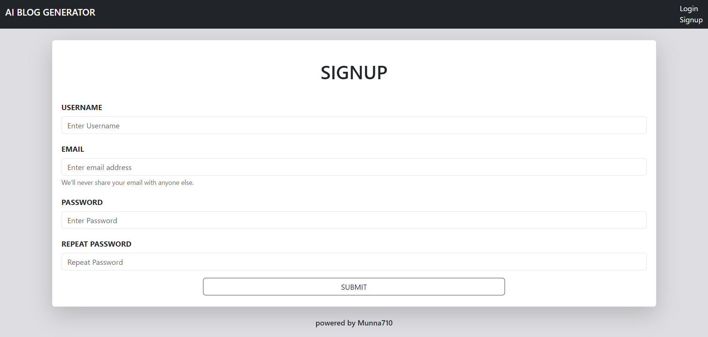
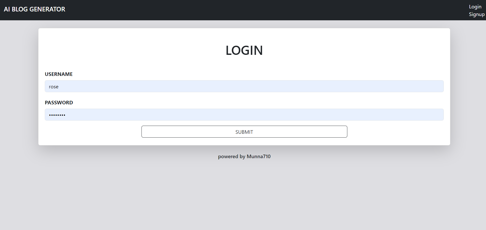
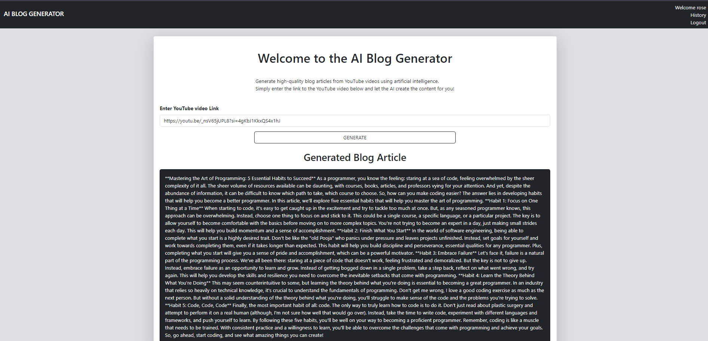
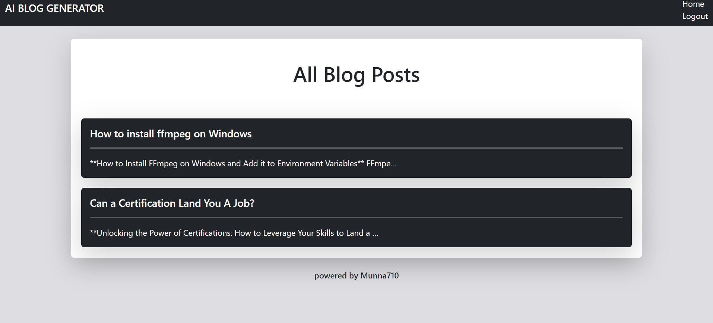
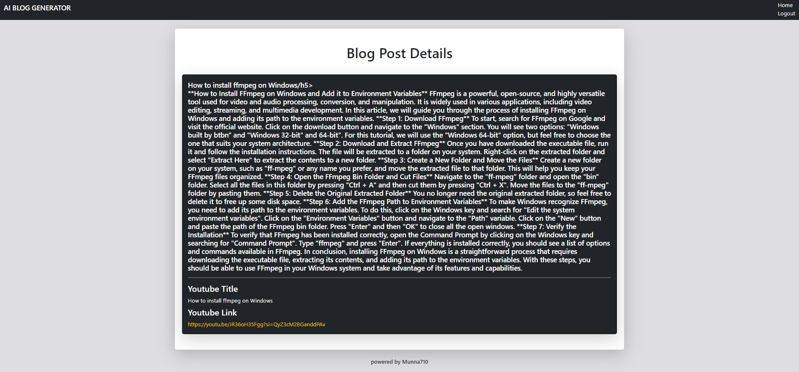

# AI Blog Generator

AI Blog Generator is a Django-based application that allows users to generate blog articles from YouTube videos. Users can sign up, log in, and generate blogs that are stored in their accounts for later access.
## Features

- User authentication (signup, login)
- Generate blog articles from YouTube video links
- Store and access generated blogs in user accounts
- Admin panel for managing the application
- Uses `pytube` to get the title of the video 
- Uses `yt-dlp` to download the MP3 file of the YouTube video
- Uses `assembly.ai` for audio transcription
- Uses `llama3.1` from `groq.com` for blog generation
- Media files are stored in the media folder

**Note:** We can use `pytube` to download video in mp3 but at my time it was giving me error that's why i used `yt-dlp`.

## Prerequisites

- Python 3.11.7 or above 
- Django
- `pytube`
- `yt-dlp`
- `assemblyai`
- `groq`

### Notes

- Ensure that [ffmpeg](https://ffmpeg.org/download.html) is installed and available in your system's PATH for `yt-dlp` to function correctly e.g: `C:\ffmpeg\bin`.
- Update the `MEDIA_ROOT` and `MEDIA_URL` settings in `settings.py` to configure media file storage.

```On default Media will be store in 'media' folder, make sure it is present in root directory where manage.py exist```

## SignUP page


## Login page


## Home


## list of Blogs 


## Blog Detail Page

